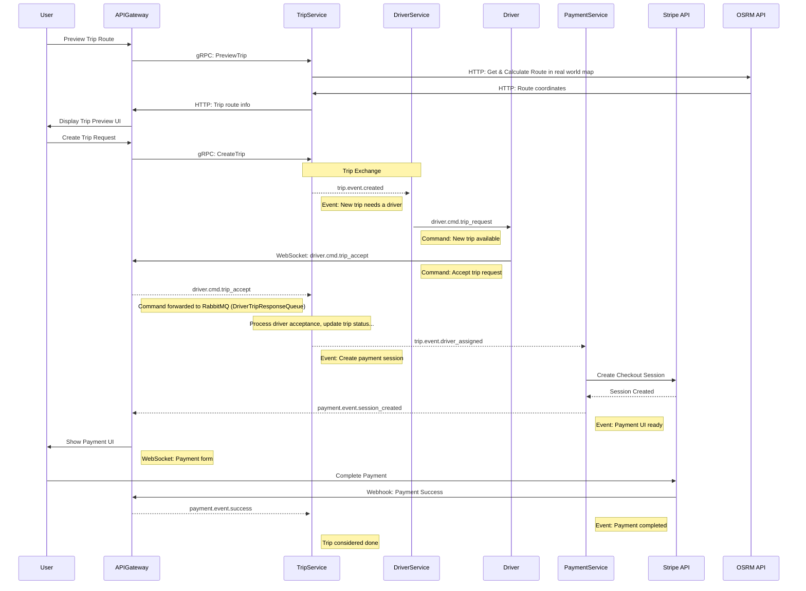

# Note

This project is primarily for practicing Go and Kubernetes. It's a starter to help me (and others) learn and experiment with building microservices and deploying them on Kubernetes.

# Microservices Go Starter

A modern, production-ready microservices starter project for Go, Docker, and Kubernetes. This project provides a scalable, modular foundation for building distributed systems, such as a ride-sharing platform.

## Features

- Modular Go microservices (API Gateway, Trip Service, etc.)
- Dockerized builds for all services
- Kubernetes manifests for local and cloud deployment
- Tilt for rapid local development
- Shared Go packages for contracts, types, and utilities
- Example web frontend (Next.js + Tailwind)

## Project Structure

```
services/
	api-gateway/         # API Gateway service (Go)
	trip-service/        # Trip management service (Go)
shared/                # Shared Go code (contracts, types, utils)
web/                   # Web frontend (Next.js, TypeScript)
infra/                 # Dockerfiles, Kubernetes manifests
build/                 # Compiled binaries
```

## Prerequisites

- Go 1.20+
- Docker
- Tilt
- A local Kubernetes cluster (Minikube, Docker Desktop, etc.)
- (Optional) Node.js for the web frontend

## Getting Started

### 1. Clone the repository

```bash
git clone <your-repo-url>
cd microservices-go-starter
```

### 2. Start local development environment

```bash
tilt up
```

- Visit the Tilt UI (usually at http://localhost:10350) to monitor builds and services.
- All services will be built, deployed, and port-forwarded automatically.

### 3. Accessing Services

- API Gateway: http://localhost:8081
- Web Frontend: http://localhost:3000

### 4. Managing Kubernetes

```bash
kubectl get pods
minikube dashboard  # or use your preferred K8s dashboard
```

## Building & Deploying

- Dockerfiles for each service are in `infra/development/docker/` and `infra/production/docker/`.
- Kubernetes manifests are in `infra/development/k8s/` and `infra/production/k8s/`.
- For production, build and push images, then apply manifests to your cluster.

## Customization

- Add new services in `services/` and update the Tiltfile and manifests as needed.
- Shared Go code lives in `shared/` for contracts, types, and utilities.
- Web frontend is in `web/` (Next.js, TypeScript, Tailwind CSS).

## Trip Creation Flow



## Contributing

Pull requests and issues are welcome! Please open an issue to discuss major changes first.

## License

MIT
